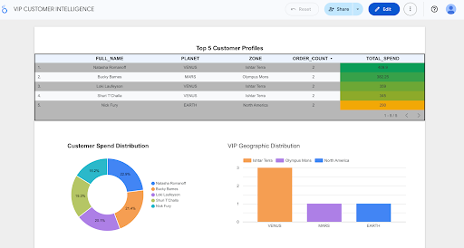

# Welcome to PlanetKart Data Warehouse & Analytics

This dbt project implements a data warehouse solution for PlanetKart, an interplanetary e-commerce company operating across Earth, Mars, and Venus.

## Project Overview

We’ve built a robust data pipeline using Airbyte, Snowflake, and dbt, applying key data warehousing concepts:

- **Modern ELT Pipeline**: Airbyte → Snowflake (PLANETKART_RAW) → dbt transformations
- **Modern dbt Project**: Staging, dimension, fact, and analytics (analyses) models in star schema
- **Advanced Fact Table**: Business logic for revenue/profit
- **Surrogate Keys** generated using `dbt_utils.generate_surrogate_key`
- **Type 2 SCD** applied to customer dimension via `dbt snapshots`
- **Robust Testing**: Constraints, freshness, and macro-based tests
- **Looker Studio Dashboard**: Executive, category, and customer views using curated reporting tables

---

## Data Architecture

### Data Flow
```
Raw Sources (Airbyte) → Snowflake Raw → Staging Layer → Dimensional Models → Analytics Layer → BI Dashboards
```

### Layer Breakdown

####  **Staging Layer** (`models/staging/`)
Clean, standardized data ready for dimensional modeling
- `stg_customers.sql` - Customer data standardization
- `stg_orders.sql` - Order transaction cleaning
- `stg_order_items.sql` - Line item details
- `stg_products.sql` - Product catalog normalization
- `stg_regions.sql` - Geographic reference data

####  **Dimensional Layer** (`models/finalmodel/`)
Star schema optimized for analytics performance
- `dim_customers.sql` - Customer dimension with business attributes
- `dim_products.sql` - Product dimension with category hierarchies
- `dim_regions.sql` - Geographic dimension (planets, zones, regions)
- `dim_date_analysis.sql` - Date dimension with business calendar
- `fact_orders.sql` - **Central fact table** with all business metrics

####  **Analytics Layer** (`models/analyses/`)
Business-ready reporting models materialized as views
- `orders_and_revenue_by_region_quarter.sql` - Regional performance trends
- `category_sales_by_region_quarter.sql` - Category performance by geography
- `avg_order_value_by_category_region.sql` - AOV analysis across dimensions
- `category_growth_by_region_quarter.sql` - Growth rate calculations
- `top_5_customers_by_region_category.sql` - Customer ranking and segmentation
- `total_sales_by_region.sql` - Geographic sales summary

---

## Project Structure

```bash
models/
planetkart/
├── README.md
├── dbt_project.yml
├── packages.yml
├── package-lock.yml
├── logs/
│   └── dbt.log
├── seeds/
│   └── (optional seed csv files for reference data)
├── macros/
│   ├── format_full_name.sql
│   ├── generate_key.sql
│   └── generate_schema_name.sql
├── dbt_packages/
│   └── dbt_utils/
│       └── ... (dbt_utils macros & docs)
├── snapshots/
│   └── snapshot_customers.sql
├── models/
│   ├── staging/
│   │   ├── stg_customers.sql
│   │   ├── stg_orders.sql
│   │   ├── stg_order_items.sql
│   │   ├── stg_products.sql
│   │   ├── stg_regions.sql
│   │   └── schema.yml
│   ├── finalmodel/
│   │   ├── dim_customers.sql
│   │   ├── dim_products.sql
│   │   ├── dim_regions.sql
│   │   ├── dim_date_analysis.sql
│   │   ├── fact_orders.sql
│   │   └── region_order_summary.sql
│   ├── analyses/
│   │   ├── orders_and_revenue_by_region_quarter.sql
│   │   ├── avg_order_value_by_category_region.sql
│   │   ├── category_sales_by_region_quarter.sql
│   │   ├── category_growth_by_region_quarter.sql
│   │   ├── top_5_customers_by_region_category.sql
│   │   └── total_sales_by_region.sql
│   └── tests/
│       └── (any custom data or schema tests)
├── target/
│   └── (dbt compiled and run artifacts)
├── screenshots/
│ 


```

##  Setup and Running Instructions

### Prerequisites
- Snowflake account with appropriate permissions
- dbt Core installed (`pip install dbt-snowflake`)
- Airbyte instance configured for data ingestion

### Quick Setup

1. **Clone and Setup**
   ```bash
   git clone <repository-url>
   cd planetkart
   dbt deps  # Install dbt_utils and other packages
   ```

2. **Configure Connection**
   ```bash
   # Update profiles.yml with your Snowflake credentials
   dbt debug  # Test connection
   ```

3. **Run Full Pipeline**
   ```bash
   dbt run              # Build all models
   dbt test             # Run data quality tests
   dbt snapshot         # Capture SCD2 changes
   dbt source freshness # Check data freshness
   ```

4. **Generate Documentation**
   ```bash
   dbt docs generate
   dbt docs serve      # View at http://localhost:8080
   ```

---

##  Business Logic & Features

###  **Smart Revenue Calculation**
The `fact_orders` table implements sophisticated business logic:
-  **Completed Orders**: Full revenue and profit attribution
-  **Pending Orders**: $0 revenue until completion
-  **Cancelled Orders**: $0 revenue, captured for analysis
-  **Profit Margins**: Calculated using product cost and sale price

###  **Historical Data Tracking**
- **Customer SCD2**: Complete audit trail of customer changes

###  **Multi-Dimensional Analysis**
- **Geographic Intelligence**: Planet → Zone → Region hierarchy
- **Temporal Insights**: Date dimension with business calendar
- **Product Categorization**: Multi-level category analysis
- **Customer Segmentation**: VIP status and behavioral groupings

---

##  Analytics & Dashboards

### Executive SUMMARY 
 
- Total Revenue & Profit
- Revenue by Planet
- Regional (zone) Performance
- Order distribution

### Category Performance Analysis

- Top-performing categories by region
- Revenue vs. Volume scatter analysis
- Catgory performance ranking
- AOV insights by category

### VIP CUSTOMER INTELLIGENCE

-  VIP customer identification
- Geographic distribution
- Spending pattern analysis

---
##  Assumptions Made:

- Orders represent a complete transaction, associated with exactly one customer.
- Products and regions are static dimensions with no history tracking required (no SDC applied).
- Customer data frequently changes, hence Type 2 SCD applied using snapshots.
- The primary grain of the fact table is at the order level (one row per order).
- Freshness interval configured to simulate stale/pass scenarios.
- Revenue calculated as quantity × price (from order items).

---

## Tools and Technologies Used

| Component | Technology | Purpose |
|-----------|------------|---------|
| **Data Ingestion** | Airbyte | ELT pipeline from source systems |
| **Data Warehouse** | Snowflake | Cloud data platform |
| **Transformation** | dbt Core | SQL-based transformations |
| **Visualization** | Looker Studio | Business intelligence dashboards |
| **Version Control** | Git | Code versioning and collaboration |

---
Key Screenshots

### 1. Hevo/Airbyte Pipeline Setup


### 2. Data Loaded in Snowflake


### 3. dbt Schema


### 4. Snowflake Schema After dbt Run

Below is a screenshot showing the loaded schemas and tables in Snowflake after running all dbt models.  


---

## Maintainer

**Muskan Kesharwani**  
*Data Engineer & Analytics Specialist*

Email: [muskankesharwani987@gmail.com](mailto:muskankesharwani987@gmail.com)  
GitHub: [github.com/muskankesharwani](https://github.com/muskankesharwani)  


---

##  Refrences

- [dbt Documentation](https://docs.getdbt.com/)
- [dbt_utils Package](https://github.com/dbt-labs/dbt-utils)
- [Snowflake Documentation](https://docs.snowflake.com/)
- [Airbyte Documentation](https://docs.airbyte.com/)
- [Looker Studio Guide](https://support.google.com/looker-studio/)